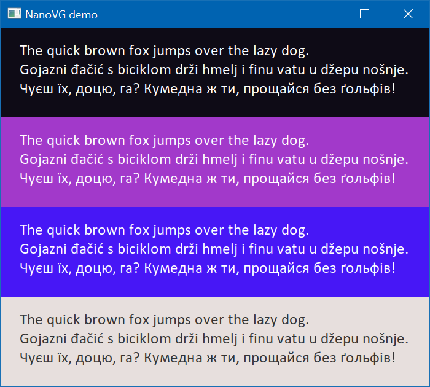
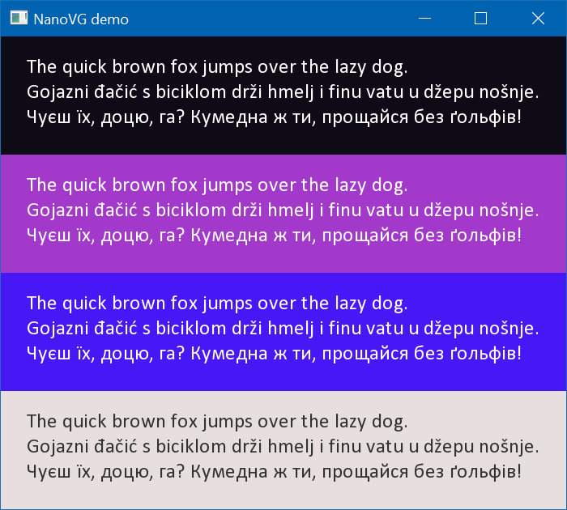

*This project is not actively maintained.*

# NanoVG ClearType Fork

This fork of NanoVG implements ClearType-like fonts rendering. Here's screenshots from Windows.

ClearType rendering:



Legacy rendering:



## How to Use

Copy `src` folder into your project, define `NANOVG_CLEARTYPE` when building the code.

Vector graphics works the same way and should render same result.

For the text, the only API change is the new `nvgTextColor()` API. You **must** use it to set color of rendered text. It accepts two `NVGcolor` arguments, for foreground and background colors. The new pixel shader calls `discard` for completely transparent pixels, but for pixels near edges of glyphs it blends over the background color specified in the `nvgTextColor` call. For background color, only RGB channels are used, alpha channel is ignored. Text alpha is taken from foreground color. Note the library premultiplies both colors with global alpha, set by `nvgGlobalAlpha` API, when submitting GL draw calls.

## Technical Details

I did that because I had a task at hands. I didn’t need an ideal implementation, I wanted good enough implementation, i.e. I've cut substantial count of corners to reduce development time.

1. Only tested on Windows (VC++ 2017, GL2, both 32 and 64 bit configs work on my PC) and 32-bit ARM Linux (gcc 6.3.0, GLES3, Mali-T764).

2. I have good C++ compilers on all platforms I care about. And C++ is quite useful for this kind of code. That’s why this fork is no longer a C library, it’s a C++ library. The library API stayed the same.

3. I’m happy with the output of vector graphics engine of NanoVG. I only needed ClearType for text. All other vector graphics should produce same results as before.

4. Original NanoVG use internal font engine by default, [`stb_truetype`](https://github.com/nothings/stb/blob/master/stb_truetype.h), and can optionally consume FreeType third party library. In this fork I’ve dropped the internal one, and require FreeType. When building the library without `NANOVG_CLEARTYPE` you should get exactly same output as before. When building the library with `NANOVG_CLEARTYPE` defined, in addition to FreeType itself, this fork requires `FT_CONFIG_OPTION_SUBPIXEL_RENDERING` to be defined at the build time of FreeType library. The [documentation page](https://www.freetype.org/freetype2/docs/reference/ft2-lcd_rendering.html) says something about patents, don’t be scared, they have already expired. Moreover, in the Debian Linux I’m targeting, apt package repository already contains `libfreetype6-dev` package built with that option.

4. Rendering ClearType text on arbitrary background requires very unorthodox blending mode. I don’t know if that’s doable with GLES3, and if yes how hard or expensive it is. Fortunately, I only needed to render text on solid color backgrounds. This fork only implements that use case.

5. Similarly, scaling or arbitrary rotating ClearType text is hard. Ideally, need to re-rasterize these glyphs, and/or specify `FT_RENDER_MODE_LCD_V` instead of `FT_RENDER_MODE_LCD`. Fortunately, in my app I don’t need text with these transformations. This fork only produces good output when the text is at 100%, not rotated, or rotated exactly 180°.

6. Blurred text is not supported when `NANOVG_CLEARTYPE` is defined.

A header-only library with thousands of lines on a single source file is easy to consume but hard to maintain or extend. In this fork I’ve refactored FontStash portion of the library to be maintainable: split the code into different files, reworked manual memory management into `std::vector` / `std::unique_ptr`, etc. I didn’t want to touch the main NanoVG code, that part is left in a single file. I’ve moved the implementation into `nanovg.cpp` but did very little changes to it, that’s why it’s about 3000 lines of code.

The repository contains a Win32 test app which sets up OpenGL and renders a few strings with NanoVG. GL part is [based on this](https://github.com/Const-me/GL3Windows). To build Windows demo, place freetype-2.10.0 next to the `nanovg` folder, and build the configurations you need. To run the demo, copy freetype.dll from `freetype-2.10.0/objs/$(Platform)/$(Configuration)` into the output folder, which is `windows/$(Platform)/$(Configuration)`

Original readme goes below.


NanoVG
==========

NanoVG is small antialiased vector graphics rendering library for OpenGL. It has lean API modeled after HTML5 canvas API. It is aimed to be a practical and fun toolset for building scalable user interfaces and visualizations.

## Screenshot



Usage
=====

The NanoVG API is modeled loosely on HTML5 canvas API. If you know canvas, you're up to speed with NanoVG in no time.

## Creating drawing context

The drawing context is created using platform specific constructor function. If you're using the OpenGL 2.0 back-end the context is created as follows:
```C
#define NANOVG_GL2_IMPLEMENTATION	// Use GL2 implementation.
#include "nanovg_gl.h"
...
struct NVGcontext* vg = nvgCreateGL2(NVG_ANTIALIAS | NVG_STENCIL_STROKES);
```

The first parameter defines flags for creating the renderer.

- `NVG_ANTIALIAS` means that the renderer adjusts the geometry to include anti-aliasing. If you're using MSAA, you can omit this flags. 
- `NVG_STENCIL_STROKES` means that the render uses better quality rendering for (overlapping) strokes. The quality is mostly visible on wider strokes. If you want speed, you can omit this flag.

Currently there is an OpenGL back-end for NanoVG: [nanovg_gl.h](/src/nanovg_gl.h) for OpenGL 2.0, OpenGL ES 2.0, OpenGL 3.2 core profile and OpenGL ES 3. The implementation can be chosen using a define as in above example. See the header file and examples for further info. 

*NOTE:* The render target you're rendering to must have stencil buffer.

## Drawing shapes with NanoVG

Drawing a simple shape using NanoVG consists of four steps: 1) begin a new shape, 2) define the path to draw, 3) set fill or stroke, 4) and finally fill or stroke the path.

```C
nvgBeginPath(vg);
nvgRect(vg, 100,100, 120,30);
nvgFillColor(vg, nvgRGBA(255,192,0,255));
nvgFill(vg);
```

Calling `nvgBeginPath()` will clear any existing paths and start drawing from blank slate. There are number of number of functions to define the path to draw, such as rectangle, rounded rectangle and ellipse, or you can use the common moveTo, lineTo, bezierTo and arcTo API to compose the paths step by step.

## Understanding Composite Paths

Because of the way the rendering backend is build in NanoVG, drawing a composite path, that is path consisting from multiple paths defining holes and fills, is a bit more involved. NanoVG uses even-odd filling rule and by default the paths are wound in counter clockwise order. Keep that in mind when drawing using the low level draw API. In order to wind one of the predefined shapes as a hole, you should call `nvgPathWinding(vg, NVG_HOLE)`, or `nvgPathWinding(vg, NVG_CW)` _after_ defining the path.

``` C
nvgBeginPath(vg);
nvgRect(vg, 100,100, 120,30);
nvgCircle(vg, 120,120, 5);
nvgPathWinding(vg, NVG_HOLE);	// Mark circle as a hole.
nvgFillColor(vg, nvgRGBA(255,192,0,255));
nvgFill(vg);
```

## Rendering is wrong, what to do?

- make sure you have created NanoVG context using one of the `nvgCreatexxx()` calls
- make sure you have initialised OpenGL with *stencil buffer*
- make sure you have cleared stencil buffer
- make sure all rendering calls happen between `nvgBeginFrame()` and `nvgEndFrame()`
- to enable more checks for OpenGL errors, add `NVG_DEBUG` flag to `nvgCreatexxx()`
- if the problem still persists, please report an issue!

## OpenGL state touched by the backend

The OpenGL back-end touches following states:

When textures are uploaded or updated, the following pixel store is set to defaults: `GL_UNPACK_ALIGNMENT`, `GL_UNPACK_ROW_LENGTH`, `GL_UNPACK_SKIP_PIXELS`, `GL_UNPACK_SKIP_ROWS`. Texture binding is also affected. Texture updates can happen when the user loads images, or when new font glyphs are added. Glyphs are added as needed between calls to  `nvgBeginFrame()` and `nvgEndFrame()`.

The data for the whole frame is buffered and flushed in `nvgEndFrame()`. The following code illustrates the OpenGL state touched by the rendering code:
```C
	glUseProgram(prog);
	glBlendFunc(GL_SRC_ALPHA, GL_ONE_MINUS_SRC_ALPHA);
	glEnable(GL_CULL_FACE);
	glCullFace(GL_BACK);
	glFrontFace(GL_CCW);
	glEnable(GL_BLEND);
	glDisable(GL_DEPTH_TEST);
	glDisable(GL_SCISSOR_TEST);
	glColorMask(GL_TRUE, GL_TRUE, GL_TRUE, GL_TRUE);
	glStencilMask(0xffffffff);
	glStencilOp(GL_KEEP, GL_KEEP, GL_KEEP);
	glStencilFunc(GL_ALWAYS, 0, 0xffffffff);
	glActiveTexture(GL_TEXTURE0);
	glBindBuffer(GL_UNIFORM_BUFFER, buf);
	glBindVertexArray(arr);
	glBindBuffer(GL_ARRAY_BUFFER, buf);
	glBindTexture(GL_TEXTURE_2D, tex);
	glUniformBlockBinding(... , GLNVG_FRAG_BINDING);
```

## API Reference

See the header file [nanovg.h](/src/nanovg.h) for API reference.

## Ports

- [DX11 port](https://github.com/cmaughan/nanovg) by [Chris Maughan](https://github.com/cmaughan)
- [Metal port](https://github.com/ollix/MetalNanoVG) by [Olli Wang](https://github.com/olliwang)
- [bgfx port](https://github.com/bkaradzic/bgfx/tree/master/examples/20-nanovg) by [Branimir Karadžić](https://github.com/bkaradzic)

## Projects using NanoVG

- [Processing API simulation by vinjn](https://github.com/vinjn/island/blob/master/examples/01-processing/sketch2d.h)
- [NanoVG for .NET, C# P/Invoke binding](https://github.com/sbarisic/nanovg_dotnet)

## License
The library is licensed under [zlib license](LICENSE.txt)
Fonts used in examples:
- Roboto licensed under [Apache license](http://www.apache.org/licenses/LICENSE-2.0)
- Entypo licensed under CC BY-SA 4.0.
- Noto Emoji licensed under [SIL Open Font License, Version 1.1](http://scripts.sil.org/cms/scripts/page.php?site_id=nrsi&id=OFL)

## Discussions
[NanoVG mailing list](https://groups.google.com/forum/#!forum/nanovg)

## Links
Uses [freetype](http://freetype.org) for font rendering.
Uses [stb_image](http://nothings.org) for image loading.



